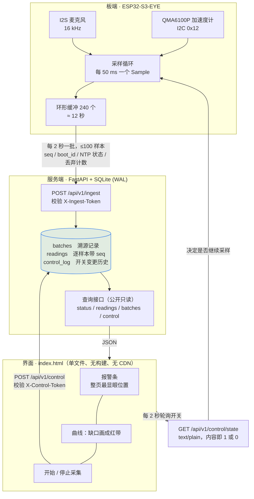

# ESP32-S3-EYE 传感数据采集与 Web 展示

把一块 ESP32-S3-EYE 变成**能自证可信**的遥测节点：板端采集加速度与声压级，经 HTTP 上报到
自建服务端，再由一个单文件网页实时展示。

项目不是为了"把数据画出来"，而是为了回答三个问题——**数据是谁给的、时间可不可信、
没有数据的时候是不是看得见**。所有设计取舍都回到这三点。

---

## 三条核心要求

| 要求 | 具体做法 |
|---|---|
| **数据来源可追溯** | 每次成功上传落一条 `batches` 记录：device_mac、boot_id、固件版本、来源 IP、User-Agent、服务端接收时刻。入库需带 `X-Ingest-Token`，否则任何能访问端口的人都能以任意 MAC 灌数据。 |
| **时间戳可信度明确** | 唯一权威时间是 `t_server_recv_ms`。设备时间只作参考，且必须由 NTP 是否同步过、同步了多久共同判定等级，界面上逐条打标。**不落库成字段**，而由原始事实派生——派生值只有一个来源，不会漂移。 |
| **无数据与上传失败必须在界面上被看见** | 静默失败不算数。设计上让"持续采样"本身成为心跳：界面安静即代表设备失联。丢样靠 `seq` 跳号判定并画成红色竖带；板上环形缓冲溢出丢弃的样本数随下次成功上传上报。 |

---

## 系统架构



文本版（便于在不支持 Mermaid 的环境阅读）：

```
板端                                    服务端                      界面
────                                    ──────                      ────
传感器 → 采样(50ms) → 环形缓冲(240)
                          │
                          │ 每 2s POST /api/v1/ingest
                          ▼
                    FastAPI ──► SQLite(WAL)
                                   │
                                   │ GET /api/v1/{status,readings,control}
                                   ▼
                                                        报警条 / 指标卡 / 曲线
                                   ▲                            │
                                   │ 每 2s 轮询开关              │ 点按钮
                                   └── control/state ◄──────────┘
```

**为什么分两张表。** `batches` 是溯源单位（一次上传 = 一条记录），`readings` 是数据单位。
同 `boot_id` 内 `seq` 不连续就是板上确有丢样的**确凿证据**，不需要靠"时间间隔看起来变大了"
去猜。跨 `boot_id` 的跳变不算丢样，但会单独报出来——那是设备重启，同样意味着数据不可信。

---

## 目录结构

```
esp32-s3-eye-telemetry/
├── README.md                        ← 本文件
├── start_server.bat                 Windows 一键启动服务端
├── docs/
│   ├── development-log.md           开发复盘：分阶段记录坑与验证结果
│   ├── week2-commands.md            第2周：远程指令通道的设计与验证（状态机/协议/端点）
│   ├── board-connect-checklist.md   插上板子网页没数据 → 排查清单（配 tools/doctor.py）
│   └── 成果总结.md                   阶段性成果与当前状态
├── firmware/                        板端（PlatformIO + Arduino）
│   ├── platformio.ini               板型覆盖：N8R8 需 8MB flash + Octal PSRAM
│   ├── include/
│   │   ├── config.h                 硬件常量（全部由实测定出，注释写明怎么测的）
│   │   └── secrets.example.h        配置模板 → 复制成 secrets.h
│   └── src/
│       ├── main.cpp                 只做接线：采集循环 + command_begin/command_poll
│       ├── sensors.cpp / .h         I2C 加速度计 + 遗留 I2S 麦克风
│       ├── uplink.cpp / .h          HTTP 统一出口、JSON 转义、ingest 报文构建
│       ├── command.cpp / .h         远程指令：领取/解析/执行/进度心跳/失败上报
│       └── secrets.h                凭据，.gitignore 排除，需自行创建
└── server/
    ├── app.py                       FastAPI 接口（数据 + 控制 + 指令）
    ├── db.py                        SQLite 存储层 + 可信度派生
    ├── commands.py                  远程指令状态机：唯一一份实现，板端与测试共用编解码
    ├── test_ingest.py               27 项测试（第1周）
    ├── test_commands.py             80 项测试（第2周）
    ├── requirements.txt
    ├── static/
    │   ├── index.html               主界面：图表、指标卡、采集开关、指令面板骨架
    │   └── commands.js              指令面板逻辑（按钮/状态/详情/防抖）
    ├── tools/
    │   ├── doctor.py                一键体检：插上板子网页没数据时定位卡在哪（只读）
    │   ├── fix_firewall.ps1         修防火墙：禁用全局入站拦截 + 放行端口（自动提权）
    │   ├── fault_inject.py          故障注入：主动制造失败以验证"失败可见"
    │   ├── command_sim.py           假设备模拟器 + 故障注入，打真实 HTTP（162 断言）
    │   └── ui_check.mjs             DOM 打桩跑界面脚本，断言报警判定与前端防抖
    ├── .env.example                 配置模板 → 复制成 .env
    └── data/telemetry.db            运行期数据库，.gitignore 排除
```

---

## 快速开始

### 一、服务端本地启动

```bash
cd server
pip install -r requirements.txt
cp .env.example .env            # Windows: copy .env.example .env
```

编辑 `.env`，至少设置一个入库令牌：

```bash
python -c "import secrets; print(secrets.token_urlsafe(32))"   # 生成
```

```ini
INGEST_TOKEN=<上面生成的值>
CONTROL_TOKEN=<再生成一个>
```

启动：

```bash
python -m uvicorn app:app --host 0.0.0.0 --port 8000 --env-file .env
```

Windows 上直接双击仓库根目录的 `start_server.bat`，它已带好 `--env-file`。

验证：

```bash
curl http://127.0.0.1:8000/health
```

浏览器打开 <http://localhost:8000/>，应看到界面（此时还没有数据）。

> **未设置令牌不会阻止启动**，但日志里会打警告。本地开发可以留空，公网部署必须设置。
>
> 也可以直接双击 `server/static/index.html`，页面会自动连本机 `127.0.0.1:8000`。
> 但**服务端必须一直在运行**——数据存在它的 SQLite 里，光有一个 HTML 文件变不出数据。
> 服务端在别的机器上时用 `index.html?api=http://服务端地址:8000` 打开。

### 二、固件编译烧录

需要 [PlatformIO](https://platformio.org/install)（VS Code 插件或 CLI 均可）。

```bash
cd firmware
cp include/secrets.example.h include/secrets.h   # Windows: copy
```

编辑 `secrets.h`：

| 宏 | 填什么 |
|---|---|
| `WIFI_SSID` / `WIFI_PASSWORD` | 2.4 GHz WiFi 凭据（ESP32 不支持 5 GHz） |
| `SERVER_URL` | 服务端所在机器的**局域网 IP**，如 `http://192.168.1.100:8000`。不能填 `127.0.0.1`，那指向板子自己。用 `ipconfig` / `ip addr` 查 |
| `INGEST_TOKEN` | 与服务端 `.env` 里的一致；服务端没设则留空 |

烧录并查看日志：

```bash
pio run -t upload
pio device monitor          # 115200
```

串口日志会打印 `boot_id`、MAC、WiFi 连接结果、NTP 同步结果，然后是 `===== 开始采集 =====`。
回到界面应在几秒内看到曲线。

**排查**：ESP32-S3-EYE 用 GPIO19/20 的原生 USB（枚举为 `303A:1001`），不是 UART 桥。
`platformio.ini` 里已设置 `ARDUINO_USB_CDC_ON_BOOT=1`，缺了它串口一句日志都看不到。
若 20 秒内连不上 WiFi，板子不会卡死，会在后台持续重试并照常采集。

烧完仍无数据时不要凭感觉猜，直接 `python server/tools/doctor.py`（见下一节）。
注意 `secrets.h` 里 `SERVER_URL` 的 IP 是**写死在固件里**的：手机热点重连后本机 IP
会变，此时必须改 `SERVER_URL` 并重新烧录，光重启服务端没用。

### 三、插上板子网页没数据？

先跑一键体检，它会按「板子 → WiFi → 本机 → 防火墙 → 数据库 → 网页」的顺序逐项检查，
FAIL 项直接给出可复制粘贴的修复命令：

```bash
python server/tools/doctor.py
```

真机联调时最常见的元凶是 **Windows 防火墙里存在一条「拦住全部入站」的 Block 规则**——
Block 的优先级高于 Allow，所以「已经放行了 8000 端口」根本不生效，板子只会报
`[uplink] HTTP -1`，而服务端日志里一条请求都看不到。修它：

```bash
powershell -ExecutionPolicy Bypass -File server/tools/fix_firewall.ps1
```

完整的排查顺序、症状速查表和换网络后的必做三件事，见
[`docs/board-connect-checklist.md`](docs/board-connect-checklist.md)。

### 四、VPS 部署

> ⚠️ **本节按标准流程编写，尚未在真实 VPS 上执行过。** 步骤本身是常规做法，
> 但请把它当作待验证的方案而非已验证的结果。执行中遇到问题欢迎提 issue。

**1. 前置准备**

- 一台有公网 IP 的 VPS（1 核 1G 足够）
- 一个域名（**上 HTTPS 必须有**，见下方说明）
- 安全组/防火墙放行 80、443；**8000 端口不要对公网开放**

**2. 部署服务端**

```bash
sudo apt update && sudo apt install -y python3-venv python3-pip nginx
git clone <你的仓库地址> /opt/telemetry && cd /opt/telemetry/server
python3 -m venv .venv && . .venv/bin/activate
pip install -r requirements.txt

cp .env.example .env
python -c "import secrets; print(secrets.token_urlsafe(32))"   # 为两个令牌各生成一个
vi .env                        # 填入 INGEST_TOKEN 与 CONTROL_TOKEN
```

**3. 交给 systemd 常驻**

`/etc/systemd/system/telemetry.service`：

```ini
[Unit]
Description=ESP32 Telemetry Server
After=network.target

[Service]
User=www-data
WorkingDirectory=/opt/telemetry/server
EnvironmentFile=/opt/telemetry/server/.env
ExecStart=/opt/telemetry/server/.venv/bin/uvicorn app:app \
          --host 127.0.0.1 --port 8000 --env-file /opt/telemetry/server/.env
Restart=always
RestartSec=5

[Install]
WantedBy=multi-user.target
```

```bash
sudo chown -R www-data:www-data /opt/telemetry/server/data
sudo systemctl enable --now telemetry
sudo systemctl status telemetry
```

> 注意 `--host 127.0.0.1`：只监听回环，由 nginx 对外。这样 8000 端口不必对公网开放。
>
> `data/` 目录必须是 `www-data` 可写，否则 SQLite 打不开，服务会一直重启。

**4. nginx 反代 + HTTPS**

`/etc/nginx/sites-available/telemetry`：

```nginx
server {
    listen 80;
    server_name telemetry.example.com;

    location / {
        proxy_pass http://127.0.0.1:8000;
        proxy_set_header Host $host;
        proxy_set_header X-Real-IP $remote_addr;   # 溯源用：来源 IP 靠它
        proxy_set_header X-Forwarded-For $proxy_add_x_forwarded_for;
    }
}
```

```bash
sudo ln -s /etc/nginx/sites-available/telemetry /etc/nginx/sites-enabled/
sudo nginx -t && sudo systemctl reload nginx
sudo apt install -y certbot python3-certbot-nginx
sudo certbot --nginx -d telemetry.example.com
```

> **`X-Real-IP` 必须设**。否则 `request.client.host` 拿到的永远是 nginx 的
> `127.0.0.1`，界面上"来源 IP"这一列就全是本机地址——直接废掉"来源可追溯"这一条要求。

**5. 验证**

```bash
curl https://telemetry.example.com/health
sudo systemctl status telemetry
sudo journalctl -u telemetry -f
```

**6. 改固件指向公网地址**

把 `secrets.h` 的 `SERVER_URL` 改成 `https://telemetry.example.com`，重新烧录。

> ⚠️ **这一步需要改代码，不是改个字符串就行。** 当前固件用的是 `HTTPClient` 明文 HTTP；
> 换成 `https://` 后需要 `WiFiClientSecure` 并配置证书校验（挂载根 CA，或临时
> `setInsecure()` 但那样就等于没有 TLS）。这是**尚未实现**的部分，见 [TODO](#todo)。

**7. 上线后立刻检查**

- `INGEST_TOKEN` 与 `CONTROL_TOKEN` 都已设置，且不是默认值
- 8000 端口从公网**不可达**（`nmap` 或在线端口扫描确认）
- 界面上"来源 IP"显示的是板子的真实内网出口地址，不是 `127.0.0.1`

---

## 接口文档

服务端启动后，FastAPI 自动生成三份，**永远与代码同步**（无需手工维护）：

| 地址 | 说明 |
|---|---|
| `/docs` | Swagger UI，可直接在页面上试调 |
| `/redoc` | ReDoc，适合通读 |
| `/openapi.json` | OpenAPI 3 schema，可导入 Postman 等工具 |

本地即 <http://localhost:8000/docs>。

以下补充 **OpenAPI 描述不了的部分**——字段语义与约定。

### 远程指令通道（第2周）

设计与取舍的完整说明见 [`docs/week2-commands.md`](docs/week2-commands.md)（含状态机流转图）。

| 方法 | 路径 | 鉴权 | 作用 |
|---|---|---|---|
| GET | `/api/v1/commands/ops` | 无 | 指令白名单与参数范围，**前端按它渲染表单** |
| POST | `/api/v1/commands` | `X-Control-Token` | 下发。新建 201；幂等命中 200 + `x-deduped: 1` |
| GET | `/api/v1/commands` | 无 | 列表 + 各状态计数 |
| GET | `/api/v1/commands/{request_id}` | 无 | 详情 + 事件时间线 |
| POST | `/api/v1/commands/{request_id}/cancel` | `X-Control-Token` | 撤销（仅 `pending`） |
| POST | `/api/v1/commands/claim` | `X-Ingest-Token` | 设备领取，**纯文本**进出 |
| POST | `/api/v1/commands/{request_id}/result` | `X-Ingest-Token` | 设备回执（running/done/failed） |

状态机：`pending → claimed → running → {done | failed}`，
另有三个失败终态 `expired`（ttl 内无人领取）、`timeout`（领取后静默）、`cancelled`（用户撤销）。
终态不可再变，迟到或重放的回执一律 `409 already_terminal`。

指令采到的样本走第1周那条 `POST /api/v1/ingest`，只是多带一个可选 `request_id`；
`GET /api/v1/readings` **默认不返回**这些样本（避免污染连续流图），
但会在 `excluded_command_samples` 里如实报出过滤了多少条，
加 `?request_id=xxx` 或 `?include_command_samples=true` 才看得到。

### 数据契约

#### `POST /api/v1/ingest` → 201，请求头 `X-Ingest-Token`

```jsonc
{
  "device_mac": "94:A9:90:1C:6F:D4",   // 服务端统一转大写
  "boot_id": "7A97EB4F",               // 每次启动随机生成，重启在服务端是可见事件
  "fw_version": "0.1.0",
  "ntp_synced": true,                  // 是否真的收到过 SNTP 应答
  "ntp_sync_age_s": 12,                // 距上次应答的秒数；未同步为 null
  "t_device_ntp_ms": 1789800826093,    // 设备时间，仅作参考；未同步为 null
  "dropped_since_last": 0,             // 上次上传失败导致缓冲溢出而丢弃的样本数
  "readings": [
    { "seq": 0, "t_device_ms": 1200, "ax": 0.01, "ay": -0.02, "az": 1.0, "spl_db": 42.3 }
  ]
}
```

| 字段 | 契约 |
|---|---|
| `seq` | 本次启动内自增。**同 `boot_id` 内不连续 = 板上确有丢样**，这是判定丢失的唯一依据。 |
| `boot_id` | 每次启动变化。跨 `boot_id` 的 `seq` 跳变**不算丢样**，但会单独报出来，因为非预期重启同样意味着数据不可信。 |
| `t_device_ms` | 设备本次启动内的毫秒数（**不是** epoch）。因此**跨重启不可比较**。 |
| `t_device_ntp_ms` | 设备换算出的 epoch 毫秒。服务端不采信它作为时间轴，只用它算 `device_clock_skew_ms` 让偏差本身可见。 |
| `dropped_since_last` | 只增不减地累积到下次成功上传。上传一直失败时它跟着涨，**失败因此不会静默消失**。 |
| `spl_db` | 可为 `null`（麦克风通道无输出）。前端遇到 null 会断开折线，**不当 0 处理**。 |
| `ax/ay/az` | 单位 g。 |
| 单批上限 | 500 条（`MAX_READINGS_PER_BATCH`）。 |

**`seq_first` / `seq_last` 由服务端从 `readings` 推导，不采信客户端上报。** 这样即使
传输途中批次被截断，缺口也会在下次查询时真实暴露。

#### 读取接口（公开只读，无需令牌）

| 接口 | 返回 |
|---|---|
| `GET /api/v1/readings?limit=&since_ms=&device_mac=` | `{count, truncated, trust:{latest,counts}, gaps, readings}` |
| `GET /api/v1/status` | 总批次数/样本数/累计丢弃/重启次数、最近 60 秒样本数、最新批次详情（含 `age_ms`、`device_clock_skew_ms`、`t_trust`） |
| `GET /api/v1/batches?limit=` | 原始溯源记录列表 |
| `GET /api/v1/control` | 当前采集开关 + 变更历史 |
| `GET /api/v1/control/state` | 设备轮询专用，`text/plain`，内容即 `1` 或 `0` |

> **`trust.counts` 才是整个窗口的真实构成**，`trust.latest` 只是最新一条的状态。
> 一个窗口里可能混着同步过和没同步过的批次，只报最后一条会误导。
>
> `since_ms` 过滤的是 `t_device_ms`（设备启动内毫秒数），**跨重启没有意义**。
> 界面刻意不使用它——这是个已知陷阱，见[已知限制](#已知限制)。

#### `POST /api/v1/control`，请求头 `X-Control-Token`

```jsonc
{ "collect": false, "note": "界面手动停止" }
```

状态没变则不写新记录，否则设备每 2 秒轮询一次会把"变更历史"塞满。

---

## 时间戳可信度口径

以服务端接收时间为权威，设备时间只在 NTP 同步过且足够新鲜时才可参考：

| 等级 | 条件 | 含义 |
|---|---|---|
| `ntp_fresh` | 同步过且年龄 ≤ 300s | 设备时间可直接参考 |
| `ntp_stale` | 年龄 301–3600s | 参考价值下降 |
| `ntp_expired` | 年龄 > 3600s | 不可参考 |
| `unsynced` | 从未同步或年龄未知 | 不可参考，`device_clock_skew_ms` 为 null |

设备端 `NTP_RESYNC_MS`（4 分钟）**必须明显小于** `NTP_FRESH_THRESHOLD_S`（300 秒），
否则同步年龄会一路涨过阈值、所有样本都被判成 `ntp_stale`，标签退化成常量。

判"同步成功"只认 SNTP 回调：`configTime()` 是异步的，之后读 `time()` 必然得到一个
"合理"的值（系统时钟本来就在走），会把"没收到任何应答"说成"刚刚同步过"。

---

## 验证

```bash
cd server
python -m pytest test_ingest.py test_commands.py -q   # 104 项（27 + 80，第1周+第2周）
node tools/ui_check.mjs                   # 对着真实服务端跑界面脚本
node tools/ui_check.mjs --origin http://127.0.0.1:8001
python tools/command_sim.py --url http://127.0.0.1:8002   # 端到端 162 项断言
```

指令通道是"服务端 / 设备 / 网页"三方异步交互，`TestClient` 那种串行假客户端盖不住时序问题
（第1周就吃过这个亏），所以 `command_sim.py` 打的是**真实 HTTP**：
它扮演一台假板子去领取、上报、回执，并主动制造 12 类失败——双击与并发提交、参数越界、
在飞超限、设备报错、迟到/错乱/越权的回执、上传掉样、领取后静默、执行中静默、设备离线——
逐条断言"失败被如实暴露"。跑完退出码非 0 即有断言失败，可直接挂 CI。

第 3 条要求（失败必须在界面上被看见）是**否定性**的——正常情况下永远看不到，
所以验证不能靠"我觉得逻辑写对了"，必须主动制造失败：

```bash
# 在隔离数据库上注入 4 种缺陷：seq 缺口、板上丢弃、NTP 未同步、彻底静默
python tools/fault_inject.py --url http://127.0.0.1:8001
```

`ui_check.mjs` 把 `index.html` 里的脚本抠出来，用最小 DOM 桩在 node 里跑，断言报警等级
与文案。这样"该报警时必须报警"可以被确定性地回归，而不必真去拔电源。

---

## 已知限制

- **有效采样率约 16.6 Hz**，低于配置的 20 Hz。每轮循环有一次阻塞式 I2S 读取（约 16 ms）。
  `t_device_ms` 如实记录，所以数据本身不误导，但采样间隔抖动尚未处理。
- **断电时未上传的缓冲样本不计入任何计数器**，只能表现为 `boot_id` 变化加上服务端
  接收时刻的空白。
- **加速度计只做了单姿态标定**（静止时 `|a| = 1g`），无法把量程误差和零偏误差分开。
  换姿态若明显偏离 1，需要多姿态拟合。
- **`X-Ingest-Token` 目前明文传输**，鉴权要真正有意义必须配合 HTTPS。
- **固件尚不支持 HTTPS**，`SERVER_URL` 只能填 `http://`。
- **`GET /api/v1/readings` 的 `since_ms` 跨重启无意义**（过滤的是设备启动内毫秒数）。
  界面刻意不用它，但接口仍然敞着。
- **`control_log` 会无限增长**，没有清理机制。低频操作下不是问题。
- **单设备假设**：`device_mac` 虽然入库，但界面只展示最新一批的来源，没有多设备视图。
  指令面板需要手填目标 MAC（服务端会把最近一批的 MAC 预填进去）。
- **指令是串行执行的**：同一台设备一次只跑一条，`MAX_LIVE_PER_DEVICE = 8` 之外的下发直接 429。
- **指令状态靠 2 秒轮询**，没有 WebSocket/SSE；`COMMAND_POLL_MS = 2000` 决定"下发到开始执行"
  的最坏时延。
- **`CONTROL_TOKEN` 存在 localStorage**，XSS 下会被读走；真要上公网得换短时效会话或服务端代理。
- **`capture` 单次上限 10 秒**是从 12 秒环形缓冲倒推的。改 `RING_CAPACITY` 或采样率时
  必须同步改 `MAX_CAPTURE_DURATION_MS`，这个耦合目前只有注释和文档，没有测试守着。

## TODO

- [ ] **VPS 部署**（本 README 已给出方案，尚未实测）
- [ ] **固件支持 HTTPS**：`WiFiClientSecure` + 证书校验，让令牌不明文上路
- [ ] 处理采样率抖动（I2S 读取改为非阻塞 / 独立任务）
- [ ] 断电前缓冲样本的持久化或计数
- [ ] 多姿态加速度标定
- [ ] `control_log` 与 `readings` 的归档/清理策略
- [ ] 多设备视图（指令面板已支持指定 MAC，图表仍是单设备）
- [ ] 指令状态推送改 WebSocket/SSE，去掉 2 秒轮询
- [ ] 控制令牌换短时效会话，别放 localStorage
- [ ] `command_events` 的归档/清理策略（与 `control_log` 同一件事）

---

开发过程中的判断依据、踩过的坑与验证结果，见 [`docs/development-log.md`](docs/development-log.md)。

## 分支约定

`main` 只放验证通过的代码。实验性改动（例如上面 TODO 里尚未验证的项）请开分支后提 PR，
不要直接推 `main`。
